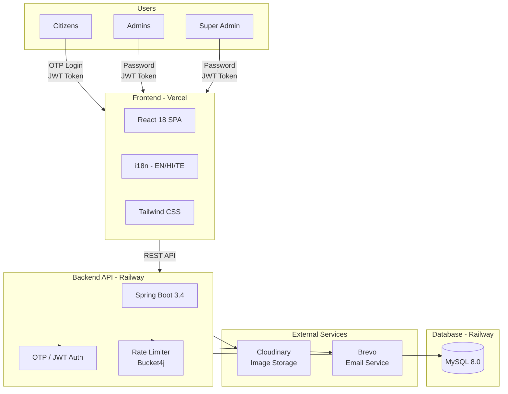

<div align="center">
  <h1>⚖️ JusticeLinker</h1>
  <p><em>Linking Courage to Justice</em></p>
  
  <p>A secure, production-ready citizen grievance reporting platform for Andhra Pradesh, India</p>
  
  <!-- Badges -->
  <p>
    <a href="https://justicelinker.vercel.app/">
      
    </a>
    
    
    
    
    
    
    
  </p>
</div>

---

## 🔗 Live Demo

**[👉 Visit JusticeLinker](https://justicelinker.vercel.app/)**

Experience the full platform - user registration, complaint filing, admin dashboard, and transparency stats.

---

## 📖 About
**JusticeLinker** is a robust, secure, and user-centric platform designed to facilitate the reporting of harassment, discrimination, and other forms of injustice. By bridging the gap between victims and authorities, JusticeLinker provides a safe haven for individuals to speak up without fear, ensuring that every voice is heard, tracked, and acted upon transparently.

## ❓ Why JusticeLinker?
In many real-world scenarios, victims of harassment or injustice hesitate to come forward due to fear of retaliation, lack of accessible reporting channels, or language barriers. 

JusticeLinker solves these critical issues by offering:
- **Anonymity & Security**: Secure reporting mechanisms protecting user identity where necessary by generating completely randomized unique tracking identifiers.
- **Accessibility**: Multi-lingual interfaces (English, Telugu, Hindi) breaking down regional barriers for rural and urban populations.
- **Transparency**: Clear workflows for tracking the real-time status of complaints (Pending, In Progress, Resolved, Rejected).
- **Evidence Management**: Seamless attachment of digital evidence (images) guaranteeing immutability.

## 👥 User Roles

JusticeLinker implements a **three-tier role-based access control (RBAC)** system:

| Role | Description | Access Level |
|------|-------------|--------------|
| 👤 **Citizens (Users)** | General public who want to report grievances | File complaints, track status, manage profile |
| 👮 **Admins** | Department-level moderators (Police, Judicial, General, etc.) | Manage assigned complaints, update status, moderate users |
| 🛡️ **Super Admin** | System administrators with full control | Create/manage admins, override any status, system-wide settings |

### User Status (Citizens)
| Status | Description |
|--------|-------------|
| ✅ **ACTIVE** | Normal user - can file complaints |
| ⏸️ **SUSPENDED** | Temporary block - cannot file complaints (admin can reactivate) |
| ❌ **TERMINATED** | Permanent ban - cannot access the platform |

### Admin Roles (Internal)
| Role | Description |
|------|-------------|
| 🛡️ **SUPER_ADMIN** | Full system access, can manage all admins, override any workflow |
| 👮 **ADMIN** | General administrators with full complaint access |
| 📋 **GENERAL_ADMIN** | Can manage all departments |
| 🏛️ **DEPARTMENT_ADMIN** | Can only manage complaints assigned to their department |
| ⚖️ **JUDICIAL_ADMIN** | Judicial review access |

## ✨ Features

### 👤 User Features
| Feature | Description |
|---------|-------------|
| 🔐 **OTP Authentication** | Secure email-based OTP login with rate limiting protection |
| 📝 **Complaint Filing** | Multi-step form with location hierarchy (State → District → Mandal → Village) |
| 🏷️ **Issue Categories** | 10+ categories: Police Misconduct, Govt Misconduct, Corruption, Political Harassment, Land Disputes, Extortion, Legal Issues, Civic Issues, Municipality, Other |
| 🎭 **Anonymous Mode** | Submit complaints without revealing identity |
| 📸 **Evidence Upload** | Attach up to 3 images (5MB each) via Cloudinary |
| 📊 **Status Tracking** | Real-time complaint status: Submitted → Under Review → Verified → Assigned → In Progress → Resolved/Rejected |
| 🌍 **Multi-Language** | Full UI in English, Hindi (हिंदी), and Telugu (తెలుగు) |
| 👤 **User Profile** | Manage personal details and default location |

### 👮 Admin Features
| Feature | Description |
|---------|-------------|
| 📈 **Dashboard** | View complaint statistics, pending/resolved counts |
| 🔍 **Advanced Filters** | Filter by state, district, mandal, village, priority, status |
| ⚡ **Priority Management** | Set priorities: P0 (Critical), P1 (High), P2 (Medium), P3 (Low) |
| 📝 **Status Updates** | Update complaint status with action logs |
| 👥 **User Management** | View and manage registered users |
| ⏸️ **Suspend Users** | Temporarily suspend users with reason + email notification |
| ❌ **Terminate Users** | Permanently terminate users with reason + email notification |
| 📋 **Action Logging** | Complete audit trail of all admin actions |
| 🔒 **Department Access** | Department admins can only manage their assigned complaints |
| 🛡️ **Status Flow Enforcement** | Strict workflow: SUBMITTED → UNDER_REVIEW → VERIFIED → ASSIGNED → IN_PROGRESS → RESOLVED → CLOSED |
| ⭐ **Super Admin Override** | Super Admin can bypass strict status flow for special cases |

### 🛡️ Security Features
| Feature | Description |
|---------|-------------|
| 🔒 **JWT Authentication** | Stateless token-based security |
| 🛡️ **Rate Limiting** | 5 OTP requests/hour, 3 wrong attempts = 30-min lockout |
| 🔄 **Database Persistence** | Rate limit tracking survives server restarts |
| 📧 **Email Notifications** | Automated emails for OTP, status changes, account actions |

### 🌐 Public Features
| Feature | Description |
|---------|-------------|
| 📊 **Transparency Dashboard** | Public stats: total complaints, pending, resolved, avg resolution time |
| 📜 **Legal Information** | Terms of service, privacy policy, disclaimer |
| 🌐 **Language Switcher** | Switch between EN/HI/TE without account |

---

## 🏗️ System Architecture



- **Frontend**: React.js Single Page Application (SPA) deployed on Vercel
- **Backend API**: Spring Boot RESTful API (Private - hosted on Railway)
- **Database**: MySQL 8.0 - ACID compliant, structured data
- **Media Storage**: Cloudinary CDN for scalable image upload/delivery
- **Email Service**: Brevo for transactional emails

### Authentication Flow
| User Type | Login Method | Token | Access Level |
|-----------|-------------|-------|--------------|
| Citizens | OTP (Email) | JWT | File complaints, track status, profile |
| Admins | Password | JWT | Manage complaints, moderate users |
| Super Admin | Password | JWT | Full system control, admin management |

---

## 💻 Tech Stack

### Frontend
| Technology | Purpose |
|------------|---------|
| [React 18](https://reactjs.org/) | UI Framework |
| [Vite 6](https://vitejs.dev/) | Build tool & dev server |
| [Tailwind CSS](https://tailwindcss.com/) | Styling |
| [React Router DOM](https://reactrouter.com/) | Client-side routing |
| [i18next](https://www.i18next.com/) | Internationalization |
| [Axios](https://axios-http.com/) | HTTP client |
| [React Hot Toast](https://react-hot-toast.com/) | Notifications |
| [Lucide React](https://lucide.dev/) | Icons |

### Backend (Private)
| Technology | Purpose |
|------------|---------|
| [Spring Boot 3.4](https://spring.io/projects/spring-boot) | Framework |
| [Java 21](https://www.java.com/) | Language |
| [Spring Security](https://spring.io/projects/spring-security) | Security |
| [JJWT](https://github.com/jwtk/jjwt) | JWT tokens |
| [Spring Data JPA](https://spring.io/projects/spring-data-jpa) | ORM |
| [Hibernate](https://hibernate.org/) | ORM Implementation |
| [MySQL Connector](https://www.mysql.com/) | Database driver |
| [Bucket4j](https://bucket4j.com/) | Rate limiting |
| [Cloudinary](https://cloudinary.com/) | Image storage |

### DevOps & Services
| Service | Purpose |
|---------|---------|
| [Vercel](https://vercel.com/) | Frontend hosting |
| [Railway](https://railway.app/) | Backend hosting |
| [MySQL](https://www.mysql.com/) | Database |
| [Cloudinary](https://cloudinary.com/) | CDN for images |
| [Brevo](https://www.brevo.com/) | Email service |

---

## 📥 Input Format

### Sample Complaint API Payload
```json
POST /api/complaints
{
  "issueType": "LAND_PROPERTY_DISPUTE",
  "otherTypeText": "",
  "subject": "Illegal land encroachment by neighbor",
  "description": "My neighbor has been illegally encroaching on my agricultural land...",
  "isAnonymous": false,
  "priority": "P1",
  "stateId": 1,
  "districtId": 5,
  "mandalId": 12,
  "villageId": 45,
  "latitude": 16.506174,
  "longitude": 80.648048,
  "attachmentUrls": [
    "https://res.cloudinary.com/.../land文档1.jpg",
    "https://res.cloudinary.com/.../survey2.jpg"
  ]
}
```

### Complaint Status Flow
```
SUBMITTED → UNDER_REVIEW → VERIFIED → ASSIGNED → IN_PROGRESS → RESOLVED
                                      ↓
                                   REJECTED

RESOLVED → CLOSED
RESOLVED → REOPENED (if issue persists)
```

---

## 🚀 Getting Started

### Prerequisites
- [Node.js](https://nodejs.org/) (v18+ recommended)

### Frontend Setup
```bash
# Clone the repository
git clone https://github.com/krishnamohan-vadlapatla/justicelinker.git
cd justicelinker/frontend

# Install dependencies
npm install

# Start development server
npm run dev
```

The frontend will be available at `http://localhost:5173`

---

## ⚙️ Engineering Decisions

| Decision | Rationale |
|----------|-----------|
| **Vite over CRA** | 10x faster Hot Module Replacement (HMR), optimized production builds |
| **JWT over Sessions** | Stateless architecture - scales horizontally effortlessly |
| **Email-based OTP** | Simple authentication for rural India - works with basic email, no third-party dependencies |
| **MySQL** | ACID compliance, reliable for structured grievance data |
| **Bucket4j with Database** | Rate limits persist across server restarts |
| **Cloudinary** | Offloads media processing, automatic optimization (WebP/AVIF) |
| **Multi-language i18n** | react-i18next for seamless EN/HI/TE support |
| **Tiered Location Data** | Pre-seeded State → District → Mandal → Village hierarchy |
| **Anonymous Complaints** | Increases trust for sensitive issues |
| **Strict Status Workflow** | Ensures proper grievance handling chain |

---

## ⚡ Performance Optimizations

| Optimization | Implementation |
|-------------|----------------|
| **Code Splitting** | React.lazy + Suspense for route-based splitting |
| **Caching** | Caffeine cache layer for rate limiting lookups |
| **Image Optimization** | Cloudinary auto-compression + WebP/AVIF serving |
| **Database Indexing** | Indexes on status, created_at, user_id columns |
| **Lazy Loading** | Images lazy-loaded, cascading dropdowns fetch on demand |
| **JWT Expiration** | 24-hour token lifetime balances security vs UX |
| **Rate Limiting** | Prevents API abuse, ensures fair resource allocation |

---

## 🔮 Future Enhancements

### Hierarchical Admin Routing (Priority)
```
Complaint Submitted
       ↓
Super Admin Reviews & Assigns
       ↓
┌─────────────────────────────┐
│   Authority Assignment:     │
├─────────────────────────────┤
│ 👮 Police Department        │ ← Law enforcement issues
│ ⚖️ Judicial Department      │ ← Legal/court matters  
│ 🏛️ General Administration  │ ← Civic/municipal issues
│ 💼 Department Admin         │ ← Specific department issues
└─────────────────────────────┘
       ↓
Department Admin Manages
       ↓
Resolution + Closure
```

**Key Points:**
- Complaints don't go directly to potentially biased departments
- Super Admin acts as initial reviewer and assigner
- Auto-escalation: Corruption complaints against Police → Judicial Department
- Department Admins can ONLY manage their assigned complaints

### Short-term (Q2 2026)
- 📱 **Mobile App**: React Native or PWA for offline-first experience
- 📊 **Analytics Dashboard**: Heatmaps, trend analysis by region/type
- 🔔 **Push Notifications**: In-app and browser notifications

### Medium-term (Q3-Q4 2026)
- 🤖 **AI Triage**: ML-based categorization and severity assessment
- 📄 **Document Upload**: PDF/document evidence support
- 💬 **WhatsApp Integration**: Submit complaints via WhatsApp

### Long-term (2027+)
- 🗣️ **Voice Input**: Audio complaint submission in local languages
- 🔗 **Blockchain Audit**: Immutable complaint history
- 🏛️ **Govt API**: Authorized API access for government systems

---

## 🤝 Contributing

We welcome contributions from developers, designers, and domain experts who share our vision of empowering citizens to report injustice.

### How to Contribute

1. **Fork** the repository
2. **Clone** your forked repository:
   ```bash
   git clone https://github.com/YOUR_USERNAME/justicelinker.git
   ```
3. **Create** a feature branch:
   ```bash
   git checkout -b feature/YourAmazingFeature
   ```
4. **Make** your changes and commit:
   ```bash
   git commit -m 'Add some AmazingFeature'
   ```
5. **Push** to your branch:
   ```bash
   git push origin feature/YourAmazingFeature
   ```
6. **Open** a Pull Request

### Areas We Need Help
- 🎨 **UI/UX**: Improve accessibility, mobile responsiveness
- 🌐 **Translations**: Add more regional languages
- 📱 **Mobile**: React Native development
- 🔒 **Security**: Security audits, penetration testing
- 📊 **Analytics**: Data visualization expertise

---

## 📬 Contact

**Project Maintainer**: [Krishna Mohan Vadlapatla](https://github.com/krishnamohan-vadlapatla)

- 🌐 **Live Demo**: [https://justicelinker.vercel.app/](https://justicelinker.vercel.app/)
- 💻 **GitHub**: [https://github.com/krishnamohan-vadlapatla/justicelinker](https://github.com/krishnamohan-vadlapatla/justicelinker)

---

## 📄 License

Distributed under the **MIT License**. See `LICENSE` for more information.

---

<div align="center">
  <p>⭐ Star us on GitHub if you find this project useful!</p>
  <p>Made with ❤️ for a more just society</p>
</div>
